# TryHackMe Warzone 1

## はじめに

本記事は、TryHackMe Warzone 1のWriteUpである。

Warzone 1は、SOC Tier 1アナリストの業務に近いシナリオとして、IDS/IPSアラートを起点にPCAPを調査し、検知がTrue Positiveかどうかを判断する演習である。

本記事では、Roomの設問を解きながら、IPアドレス、ドメイン、User-Agent、ファイル名、HTTP通信などの証跡を抽出し、外部脅威インテリジェンスとPCAP上の観測事実を突き合わせる手順を整理する。

本記事の目的は、以下の2点である。

1. SOCアラートトリアージおよびネットワークフォレンジックの学習成果をポートフォリオとして整理すること。
2. Brim/Zui、Wireshark、VirusTotalを用いた調査プロセスを復習し、学習内容を定着させること。

| 項目   | 値                                     |
| :--- | :------------------------------------ |
| Room | Warzone 1                             |
| URL  | https://tryhackme.com/room/warzoneone |
| カテゴリ | Network Forensics                     |
| OS   | Linux                                 |
| Tool | Brim/Zui, Wireshark, VirusTotal       |
| 技術タグ | TA505, MirrorBlast, T1071.001, T1105  |
| 作成日  | 2026/06/28                            |

---

## 結論サマリー

内部ホスト `172.16.1.102` が、MirrorBlast関連とみられる外部インフラへHTTP通信を行っていた。Suricataでは `ET MALWARE MirrorBlast CnC Activity M3` が発火し、HTTP User-Agentには `REBOL View 2.7.8.3.1` が記録されていた。このUser-Agentは、MirrorBlastの既知TTPであるRebol loaderの利用と整合する。

また、関連する外部IPアドレス `185[.]10[.]68[.]235` および `192[.]36[.]27[.]92` から、MSIファイル `filter.msi` および `10opd3r_load.msi` が取得されていた。WiresharkでHTTP Streamを追跡したところ、HTTPレスポンスヘッダおよびGETリクエストのURLパスから、これらのファイル名を特定できた。

さらに、HTTPペイロード内には `C:\ProgramData\...` 配下に展開されるとみられるファイルパス文字列が含まれていた。以上の観測事実から、本アラートはFalse Positiveではなく、MirrorBlast関連活動と整合するTrue Positiveとして扱うべきである。

ただし、PCAP単体では、ホスト上でのファイル作成、プロセス実行、永続化、権限昇格、横展開までは確定できない。実環境であれば、EDRログ、Sysmon、Windows Event Log、Amcache、ShimCache、Prefetch、MFT、USN Journalなどのホスト証跡を追加で調査する必要がある。

---

## 調査方針

本調査では、PCAPを起点として以下の順序で分析を進める。

1. Brim/ZuiでSuricataアラートを抽出し、検知シグネチャ、送信元IP、送信先IPを特定する。
2. HTTPログから、関連する外部IP、Host、URI、User-Agentを抽出する。
3. VirusTotalでPassive DNS、Communicating Files、Community情報を参照し、既知の脅威インフラとの関連を評価する。
4. Wiresharkで該当通信のHTTP StreamまたはTCP Streamを追跡し、HTTPヘッダ、ファイル名、パス文字列、User-Agentなどの証跡を確認する。
5. 観測事実を整理し、True PositiveかFalse Positiveかを判定する。

Brim/Zuiを最初に使用する理由は、SuricataアラートとZeekログを高速に検索・集計でき、トリアージの起点となるIPアドレスと通信種別を素早く特定できるためである。

次にVirusTotalを参照する理由は、PCAP上のIPアドレスやドメインだけでは、それが既知の脅威インフラかどうかを判断できないためである。外部脅威インテリジェンスを用いることで、観測されたIOCが既知キャンペーンや脅威アクターと関連するかを評価できる。

最後にWiresharkで深掘りする理由は、調査対象の通信を絞り込んだ後にHTTPペイロードやストリーム内容を確認することで、無関係なトラフィックを追う時間を削減できるためである。

---

## アラートトリアージ、PCAP初期解析、脅威インテリジェンス分析

### Q1. What was the alert signature for Malware Command and Control Activity Detected?

IDS/IPSで検知された `"Malware Command and Control Activity Detected"` が、どのシグネチャによって検知されたのかを調査する。

PCAPをBrim/Zuiで読み込み、Suricataのalertイベントを抽出する。

```zng
event_type=="alert"
| count() by alert.severity, alert.category, alert.signature
| sort -r count
```

このクエリでは、`event_type=="alert"` によりSuricataのアラートイベントのみを抽出し、`count() by` でseverity、category、signatureの組み合わせごとに集計する。

`sort -r count` は、件数の多い順に結果を並べるための指定である。Zed/Zuiの `sort` はデフォルトでは昇順であるため、降順で確認したい場合は `-r` を明示する。

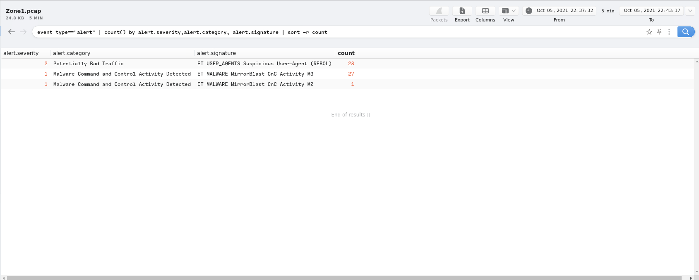  

この結果から、`Malware Command and Control Activity Detected` に該当するシグネチャは `ET MALWARE MirrorBlast CnC Activity M3` であると特定できる。

**Answer:** `ET MALWARE MirrorBlast CnC Activity M3`

シグネチャ名の読み方は以下のとおりである。

* `ET`: Emerging Threatsのルールセットを示す。
* `MALWARE`: マルウェア関連の検知カテゴリを示す。
* `MirrorBlast`: 関連するマルウェアファミリーまたはキャンペーン名を示す。
* `CnC Activity`: Command and Control通信に関連する検知であることを示す。
* `M3`: ルールのバリアントを識別するサフィックスである。

この時点で、内部ホストがMirrorBlast関連のC2通信を行った可能性があるため、該当アラートの送信元・送信先を調査する。

---

### Q2. What is the source IP address? Enter your answer in a defanged format.

アラートを発生させた通信の送信元IPアドレスを特定する。

以下のクエリで、アラートシグネチャ、送信元IP、送信先IPを抽出する。

```zng
event_type=="alert"
| cut alert.signature, src_ip, dest_ip
| sort alert.signature, src_ip, dest_ip
| uniq
```

`uniq` は隣接する重複レコードを除去する演算子である。そのため、非隣接の重複を確実に除去するには、事前に `sort` を行う。

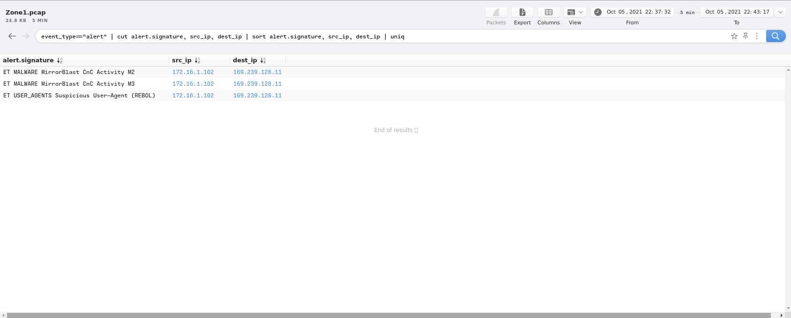  

抽出結果から、全てのアラートシグネチャで送信元IPおよび送信先IPが共通していることが判明した。

**Answer:** `172[.]16[.]1[.]102`

`172.16.0.0/12` はRFC1918で定義されたプライベートIPアドレス空間である。そのため、`172.16.1.102` は組織内部のエンドポイントと判断できる。

defangとは、IPアドレスやURLをそのままコピーしてもクリックや名前解決が発生しないよう、ドット `.` を `[.]` に置き換える表記である。セキュリティレポートやWriteUpでIOCを記載する際に使用される。

---
### Q3-1. What IP address was the destination IP in the alert? Enter your answer in a defanged format.

アラートを発生させた通信の送信先IPアドレスを特定する。

前問と同じクエリ結果の `dest_ip` フィールドから、送信先IPアドレスを読み取る。

**Answer:** `169[.]239[.]128[.]11`

`169[.]239[.]128[.]11` はグローバルIPアドレスである。内部ホスト `172[.]16[.]1[.]102` から外部IPアドレス `169[.]239[.]128[.]11` への通信で、MirrorBlast関連のC2アラートが発火している。

この時点では、当該IPをC2サーバと断定するのではなく、「C2通信として検知された外部IP」または「C2疑いIP」として扱うのが適切である。

次のステップとして、このIPアドレスをVirusTotalで調査し、既知の脅威インフラとの関連を確認する。

---

### Q3-2. Inspect the destination IP in VirusTotal. Under Relations > Passive DNS Replication, which domain has the most detections?

Q3で特定した送信先IP `169[.]239[.]128[.]11` をVirusTotalで検索し、`Relations` タブの `Passive DNS Replication` を参照する。

Passive DNSとは、DNSクエリとレスポンスの履歴をパッシブに収集・蓄積した情報である。  
攻撃者はIPアドレスを再利用しながらドメイン名を切り替えることがあるため、Passive DNSの履歴を参照することで、同一インフラに紐づいた過去のドメインを追跡できる場合がある。

VirusTotal上では、当該IPに紐づくPassive DNS項目の中に複数のドメインが検出されている。

以下のクエリで、PCAP内のDNSクエリも抽出する。

```zng
_path=="dns"
| count() by query
| sort -r
```

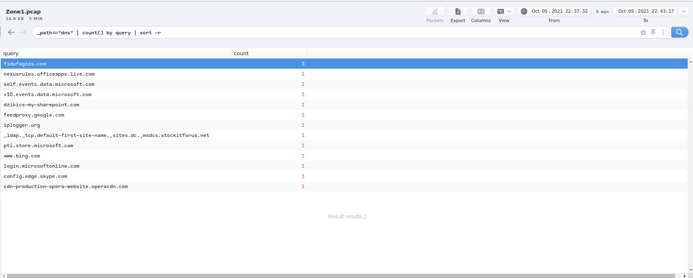

PCAPに記録されているドメインをPassive DNS Replicationと比較することで、アクセスした可能性のある悪性ドメインを特定できる。

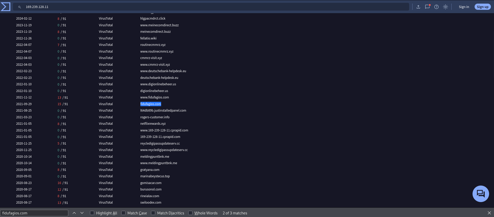

**Answer:** `fidufagios[.]com`

ただし、Passive DNSは「過去に名前解決上の関連が観測された」ことを示す情報であり、その時点で当該ドメインが現在もアクティブなC2であることを単独で証明するものではない。  
現在の有効性を評価するには、DNS履歴、WHOIS、証明書履歴、URLhaus、abuse.ch、ベンダーレポートなどの追加調査が必要である。

---

### Q4. Still in VirusTotal, under Community, what threat group is attributed to this IP address?

VirusTotalの `Community` タブには、セキュリティリサーチャーやベンダーがIOCに関する文脈情報を投稿している場合がある。

`fidufagios[.]com` に対するCommunity情報を参照し、関連づけられている脅威グループを調査する。

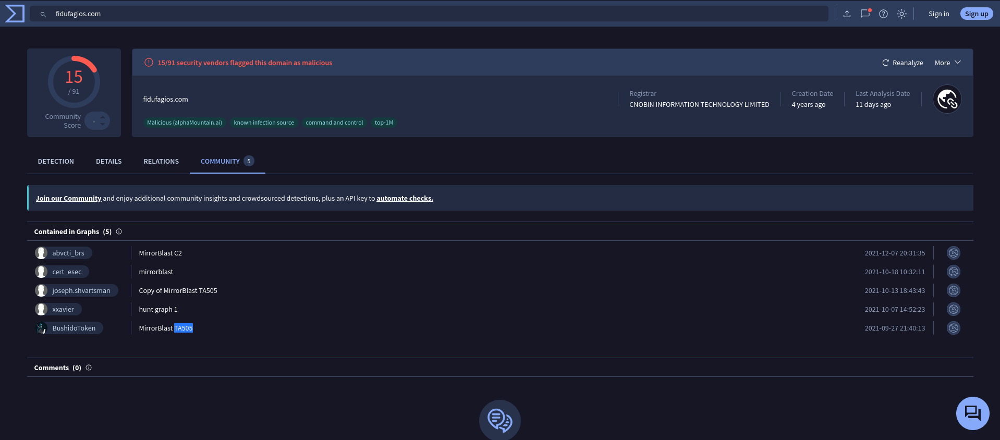

**Answer:** `TA505`

TA505は、MITRE ATT&CKで `G0092` として追跡されている金銭目的のサイバー犯罪グループである。2014年頃から活動が確認されており、マルウェア配布、大規模フィッシング、ランサムウェア関連活動などで知られている。

ただし、VirusTotal Community上の投稿は有用な手がかりである一方、帰属の一次証拠ではない。  
そのため、実務ではMITRE ATT&CK、ベンダーレポート、マルウェア解析レポート、インフラ重複、TTPの一致など、複数の情報源と照合して評価する必要がある。

本調査では、VirusTotal上のTA505という文脈情報に加え、MirrorBlast、REBOL View User-Agent、後続調査で特定したMSIファイルの取得といった観測事実が既知TTPと整合しているため、TA505/MirrorBlast関連活動として扱う妥当性が高いと判断する。

---

### Q5. What is the malware family?

前問までの調査で特定した文脈から、このキャンペーンまたはマルウェアファミリー名を確認する。

VirusTotalのCommunityに表示される情報、およびSuricataシグネチャ名を照合すると、今回の通信はMirrorBlast関連活動として扱うのが妥当である。

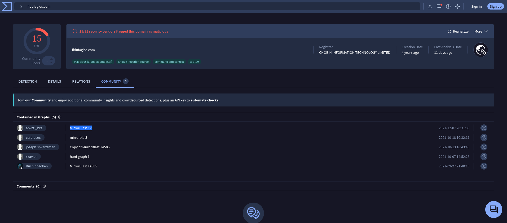

**Answer:** `MirrorBlast`

MirrorBlastは、TA505の活動と関連づけられているマルウェアファミリー、ローダー、またはキャンペーン名として扱われる。  
Proofpointなどの公開情報では、TA505がMSIファイルを配布し、Rebol loaderやMirrorBlast loaderを利用したキャンペーンを行っていたことが報告されている。

本PCAPでも、以下の観測事実がMirrorBlast関連活動と整合する。

* Suricataシグネチャ `ET MALWARE MirrorBlast CnC Activity M3` の発火
* HTTP User-Agent `REBOL`
* 後続調査で確認するMSIファイルの取得

ただし、PCAP単体ではマルウェアの実行やホスト上での侵害範囲までは確定できない。  
そのため、ここではネットワーク上の観測事実と外部脅威インテリジェンスがMirrorBlast関連活動と整合する、という範囲で評価する。

---

### Q6. Do a search in VirusTotal for the domain from question 4. What was the majority file type listed under Communicating Files?

Q3-2で特定したドメイン `fidufagios.com` をVirusTotalで検索し、`Relations` タブの `Communicating Files` を参照する。

Communicating Filesとは、VirusTotalで過去に解析されたファイルのうち、当該ドメインと通信したことが観測されたファイル群である。  
この情報により、当該ドメインと関連するファイル種別を把握できる。

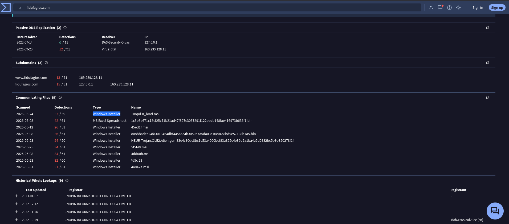

**Answer:** `Windows Installer`

Windows Installerは、一般に `.msi` ファイルとして扱われるインストーラパッケージ形式である。

TA505/MirrorBlast関連活動ではMSIファイルが配布に利用された事例が報告されており、本設問のVirusTotal情報とも整合する。

ただし、Communicating FilesはVirusTotal上の過去分析結果に基づく関連情報であり、PCAP内のファイルが実際にそのドメインと通信したことを直接証明するものではない。  
PCAP上の観測事実として扱うには、HTTP通信、Host、URI、ファイル名、送信元・送信先IPを突き合わせて評価する必要がある。

---

### Q7. Inspect the web traffic for the flagged IP address; what is the user-agent in the traffic?

`169[.]239[.]128[.]11` へのHTTPトラフィックを調査し、通信に使用されたUser-Agentを特定する。

Brim/Zuiで以下のクエリを実行する。

```zng
_path=="http"
| cut id.orig_h, id.resp_h, id.resp_p, method, host, uri, user_agent
| sort id.orig_h, id.resp_h, host, uri, user_agent
| uniq
```

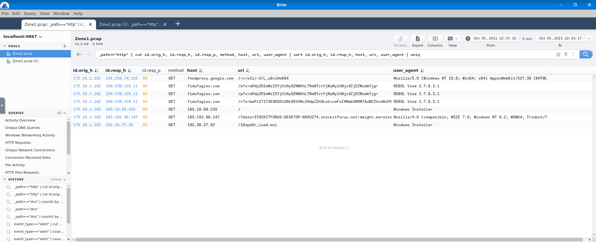

内部ホスト `172.16.1.102` から外部IPアドレス `169[.]239[.]128[.]11` への通信を抽出し、HTTPリクエストに含まれるUser-Agentを読み取る。

HTTP通信の件数も併せて把握したい場合は、以下のように集計する。

```zng
_path=="http"
| count() by id.orig_h, id.resp_h, host, uri, user_agent
| sort count desc
```

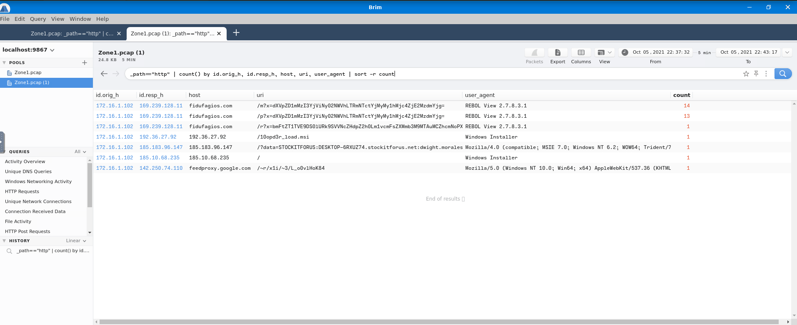

**Answer:** `REBOL View 2.7.8.3.1`

User-AgentはHTTPリクエストヘッダの一つであり、通信元ソフトウェアを識別する文字列である。

`REBOL View 2.7.8.3.1` は、MirrorBlast関連活動の既知TTPと整合する重要な観測事実である。  
特に、SuricataのMirrorBlast C2シグネチャが発火している通信において、HTTP User-Agentに `REBOL` が含まれている点は、False PositiveではなくTrue Positiveとして評価する上で強い根拠となる。

---

### Q8. Retrace the attack; there were multiple IP addresses associated with this attack. What were two other IP addresses? Enter the IP addressed defanged and in numerical order. (format: IPADDR,IPADDR)

攻撃に関連する追加のIPアドレスを特定する。

HTTPログから、内部ホスト `172.16.1.102` が通信した外部IPアドレスを抽出する。

```zng
_path=="http"
| count() by id.orig_h, id.resp_h, host
| sort -r count 
```


既知のC2疑いIP `169[.]239[.]128[.]11` 以外にも、複数の外部IPアドレスが現れる。それぞれをVirusTotalで検索し、悪性判定やMirrorBlast/TA505との関連情報を照合する。

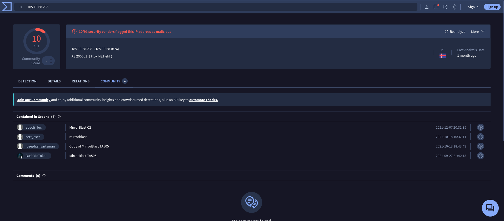

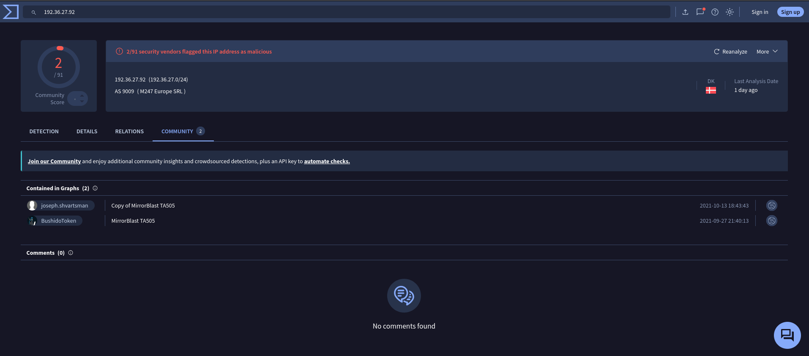

**Answer:** `185[.]10[.]68[.]235,192[.]36[.]27[.]92`

この2つのIPアドレスは、後続の設問でMSIファイルのダウンロード元として扱われる。  
したがって、本記事ではこれらを「追加C2 IP」とは断定せず、「関連外部IP」または「MSIダウンロード元IP」と表現する。

数値順で記載する必要があるため、`185[.]10[.]68[.]235,192[.]36[.]27[.]92` の順で回答する。

補足として、Brim/ZuiのHTTPログには `185[.]183[.]96[.]147` も送信先IPアドレスとして現れる。

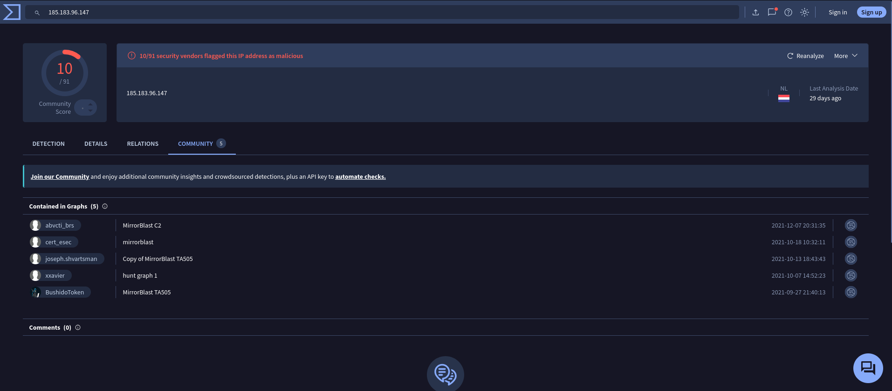

現在のVirusTotalでは、このIPアドレスは複数ベンダーにより悪性判定されており、Communityの `Contained in Graphs` でも `MirrorBlast C2` や `MirrorBlast TA505` などの関連グラフが確認できる。  
そのため、現在の脅威インテリジェンスを基準にすれば、`185[.]183[.]96[.]147` もMirrorBlast/TA505関連の補足IOCとして記録する価値がある。

ただし、TryHackMeのRoomは過去に作成された演習であり、設問の期待回答はRoom作成時点のVirusTotal情報、または作成者が想定した調査経路に依存している。  
外部TIは時間の経過とともに更新されるため、現在のVirusTotalで関連情報が確認できることと、Roomの採点上の正答に含まれることは一致しない。  
本記事では、RoomのAnswerとしては `185[.]10[.]68[.]235` および `192[.]36[.]27[.]92` を採用し、`185[.]183[.]96[.]147` は補足IOCとして扱う。

---

### Q9. What were the file names of the downloaded files? Enter the answer in the order to the IP addresses from the previous question. (format: file.xyz,file.xyz)

Q8で特定した2つのIPアドレス、`185[.]10[.]68[.]235` および `192[.]36[.]27[.]92` からダウンロードされたファイル名を特定する。

WiresharkでPCAPを開き、まず `185[.]10[.]68[.]235` を対象に表示フィルタを設定する。

```text
ip.addr == 185.10.68.235
```

該当するHTTPパケットを選択し、右クリックから `Follow` → `HTTP Stream` を開く。  
レスポンスヘッダには `Content-Disposition: filename=filter.msi` が含まれており、この値からダウンロードファイル名が `filter.msi` であると判断できる。  
また、`Content-Type: application/x-msi` から、ファイル種別がMSIインストーラであることも読み取れる。

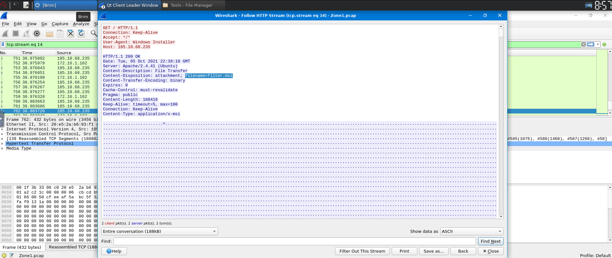

次に、`192[.]36[.]27[.]92` についても同様にHTTP Streamを確認する。  
この通信では `Content-Disposition` ヘッダが見当たらないため、GETリクエストのリクエストラインを参照する。  
`GET /10opd3r_load.msi HTTP/1.1` とURLパスにファイル名が含まれているため、ダウンロードファイル名は `10opd3r_load.msi` と判断できる。

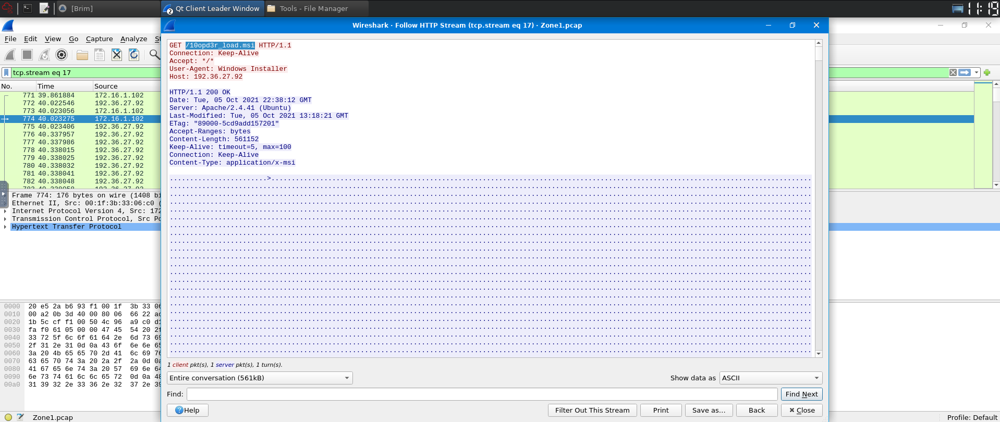

**Answer:** `filter.msi,10opd3r_load.msi`

IPアドレスの順序に対応して、以下のように整理できる。

| IPアドレス              | 役割           | ファイル名            |
| :------------------ | :----------- | :--------------- |
| 185[.]10[.]68[.]235 | MSIダウンロード元IP | filter.msi       |
| 192[.]36[.]27[.]92  | MSIダウンロード元IP | 10opd3r_load.msi |

いずれもMSIファイルであり、VirusTotalのCommunicating Filesで確認したWindows Installerというファイル種別、およびTA505/MirrorBlast関連活動におけるMSI利用のTTPと整合する。

---

### Q10. Inspect the traffic for the first downloaded file from the previous question. Two files will be saved to the same directory. What is the full file path of the directory and the name of the two files? (format: C:\path\file.xyz,C:\path\file.xyz)

1件目のダウンロードファイル `filter.msi` に関連する通信をWiresharkで調査する。

Wiresharkで以下のDisplay Filterを設定する。

```text
ip.addr == 185.10.68.235
```

対象パケットを右クリックし、`Follow` → `TCP Stream` を選択する。HTTPペイロード内に、ASCII文字列としてファイルパスが含まれていることを読み取る。

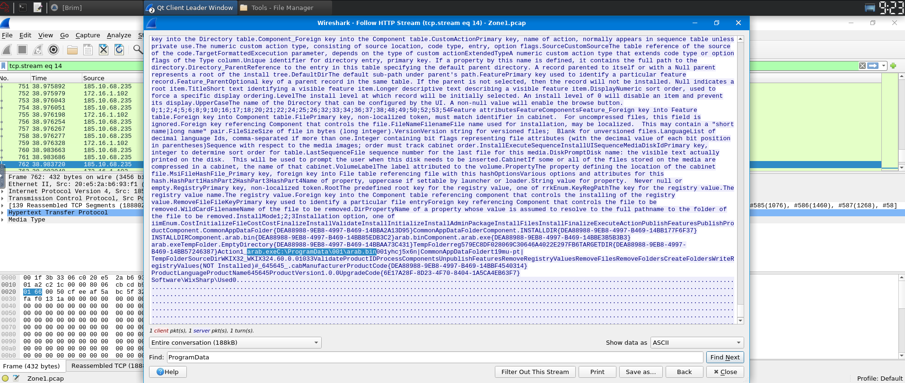

**Answer:** `C:\ProgramData\001\arab.bin,C:\ProgramData\001\arab.exe`

ここで確認できるのは、PCAP内のHTTPペイロードに上記のファイルパス文字列が含まれているという事実である。  
PCAP単体では、実際にホスト上でファイルが作成されたか、実行されたかまでは確定できない。

実環境であれば、以下のホスト証跡を追加で調査する必要がある。

* EDRのファイル作成イベント
* Sysmon Event ID 11: FileCreate
* Sysmon Event ID 1: Process Creation
* Windows Event Log
* Amcache
* ShimCache
* Prefetch
* MFT
* USN Journal

`C:\ProgramData` は、Windowsにおける全ユーザー共通のアプリケーションデータディレクトリである。  
マルウェアがこのディレクトリを使用する理由としては、標準ユーザー権限でも書き込み可能な場合があり、一般ユーザーが日常的に確認しないパスであるため発見が遅れやすい点が挙げられる。

---

### Q11. Now do the same and inspect the traffic from the second downloaded file. Two files will be saved to the same directory. What is the full file path of the directory and the name of the two files? (format: C:\path\file.xyz,C:\path\file.xyz)

2件目のダウンロードファイル `10opd3r_load.msi` に関連する通信をWiresharkで調査する。

Wiresharkで以下のDisplay Filterを設定する。

```text
ip.addr == 192.36.27.92
```

対象パケットを右クリックし、`Follow` → `TCP Stream` を選択する。  
HTTPペイロード内のASCII文字列を確認すると、REBOL View実行ファイルとREBOLスクリプトとみられるファイルパスが含まれている。

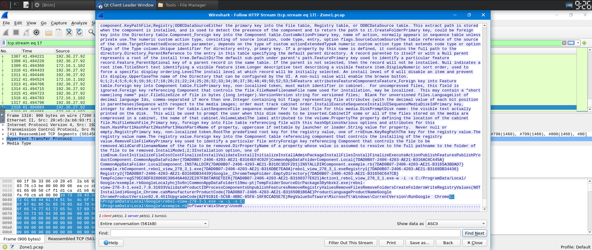

**Answer:** `C:\ProgramData\Local\Google\rebol-view-278-3-1.exe,C:\ProgramData\Local\Google\exemple.rb`

`rebol-view-278-3-1.exe` はREBOL Viewの実行ファイルとみられる。これは、前段で確認したHTTP User-Agent `REBOL View 2.7.8.3.1` と整合する。

`exemple.rb` はREBOLスクリプトファイルとみられる。`rebol-view-278-3-1.exe` がこのスクリプトを読み込み、後続の処理を実行する構成が想定される。

ただし、PCAP単体で確認できるのは、HTTPペイロード内にこれらのファイルパス文字列が含まれていることまでである。実際にホスト上でファイルが作成されたか、プロセスとして実行されたかは、EDRログ、Sysmon、Windows Event Log、Amcache、ShimCache、Prefetch、MFT、USN Journalなどのホスト証跡で追加確認する必要がある。

`C:\ProgramData\Local\Google` というパスは、Google関連の正規アプリケーションディレクトリに見せかける意図がある可能性がある。  
これはMITRE ATT&CKのMasquerading、すなわち `T1036` と関連する可能性がある。ただし、PCAP単体では攻撃者の意図を完全には証明できないため、本記事では「T1036の可能性がある」と表現する。

---
## 攻撃シーケンス再構成

### 観測事実ベースの時系列

PCAP上の通信をもとに、攻撃シーケンスを整理する。

実際のタイムスタンプは、Brim/Zuiの `ts` フィールドまたはWiresharkのTime列を参照して追記する。

| 順序 | 時刻          | 観測内容                       | 送信元          | 送信先                  | 証拠                                                           | 解釈                  |
| :- | :---------- | :------------------------- | :----------- | :------------------- | :----------------------------------------------------------- | :------------------ |
| 1  | 2021-10-05 22:42 | MirrorBlast C2関連アラート       | 172.16.1.102 | 169[.]239[.]128[.]11 | Suricata alert: `ET MALWARE MirrorBlast CnC Activity M3`     | MirrorBlast C2通信疑い  |
| 2  | 2021-10-05 22:42 | HTTP通信でREBOL User-Agentを記録 | 172.16.1.102 | 169[.]239[.]128[.]11 | `REBOL View 2.7.8.3.1`                                       | MirrorBlast既知TTPと整合 |
| 3  | 2021-10-05 22:38 | MSIファイル取得                  | 172.16.1.102 | 185[.]10[.]68[.]235  | `filter.msi`                                                 | 追加ペイロード取得           |
| 4  | 2021-10-05 22:38 | ペイロード内にファイルパス文字列を記録        | -            | -                    | `C:\ProgramData\001\arab.bin`, `C:\ProgramData\001\arab.exe` | 展開先候補の把握            |
| 5  | 2021-10-05 22:38 | MSIファイル取得                  | 172.16.1.102 | 192[.]36[.]27[.]92   | `10opd3r_load.msi`                                           | 追加ペイロード取得           |
| 6  | 2021-10-05 22:38 | ペイロード内にREBOL関連パス文字列を記録     | -            | -                    | `rebol-view-278-3-1.exe`, `exemple.rb`                       | REBOL loader構成と整合   |

この表では、「観測事実」と「解釈」を分離している。観測事実は、PCAP、Suricataアラート、HTTPログ、HTTP Stream、TCP Streamから読み取れる内容である。  
一方、解釈は、それらの証跡を既知TTPや脅威インテリジェンスと照合した評価である。

---

## True Positive判定

本アラートはTrue Positiveと判断する。

根拠は以下である。

### 証拠1：MirrorBlast関連Suricataシグネチャの発火

Suricataで `ET MALWARE MirrorBlast CnC Activity M3` が発火している。

このシグネチャはMirrorBlast関連のC2通信を検知するものであり、HTTP通信上の特徴をもとに発火している。アラート対象が内部ホストから外部IPへの通信である点も、C2通信の疑いを強める。

### 証拠2：内部ホストから外部IPへの通信

アラート対象通信の送信元は内部ホスト `172.16.1.102`、送信先は外部IP `169[.]239[.]128[.]11` である。

内部ホストが、MirrorBlast関連として検知された外部IPへ通信していることは、False Positiveではなく実際の不審通信である可能性を示す。

### 証拠3：REBOL View User-Agentの記録

HTTPログ上で `REBOL View 2.7.8.3.1` のUser-Agentが記録されていた。

MirrorBlast関連活動ではRebol loaderの利用が報告されているため、このUser-Agentは既知TTPと整合する重要な証跡である。

### 証拠4：MSIファイルの取得

関連外部IP `185[.]10[.]68[.]235` および `192[.]36[.]27[.]92` から、MSIファイル `filter.msi` および `10opd3r_load.msi` が取得されていた。

TA505/MirrorBlast関連活動では、MSIファイルが配布に使われた事例が報告されている。したがって、MSIファイルの取得は、MirrorBlast関連活動の可能性を補強する。

### 証拠5：HTTPペイロード内のファイルパス文字列

HTTPペイロード内には、以下のパス文字列が含まれていた。

* `C:\ProgramData\001\arab.bin`
* `C:\ProgramData\001\arab.exe`
* `C:\ProgramData\Local\Google\rebol-view-278-3-1.exe`
* `C:\ProgramData\Local\Google\exemple.rb`

これらは、ペイロードがホスト上に展開しようとするファイルパス、またはインストーラ内で参照されるファイルパスとみられる。

ただし、PCAP単体では実際のファイル作成や実行までは確定できない。実行有無や侵害範囲を判断するには、ホストベースの証跡が必要である。

### 判定

以上より、ネットワーク観測上はMirrorBlast関連活動と整合する複数の証跡が得られているため、本アラートはFalse PositiveではなくTrue Positiveとして扱うべきである。

実運用であれば、内部ホスト `172.16.1.102` を優先的に隔離し、ホストフォレンジックおよびEDRログ調査へエスカレーションする。

---

## 調査チェーンサマリー

### 調査フローとMITRE ATT&CKマッピング

| フェーズ         | 観測された活動                             | SOCの確認手段                           | MITRE ATT&CK | 確度  |
| :----------- | :---------------------------------- | :--------------------------------- | :----------- | :-- |
| C2通信         | `169[.]239[.]128[.]11` へのHTTP通信     | Suricataアラート、HTTPログ                | T1071.001    | 高   |
| 脅威インテリジェンス照合 | TA505 / MirrorBlastとの関連評価           | VirusTotal, MITRE ATT&CK, ベンダーレポート | -            | 中   |
| 追加ペイロード取得    | MSIファイルのダウンロード                      | Wireshark HTTP Stream              | T1105        | 高   |
| スクリプト実行基盤    | REBOL View関連ファイルのパス文字列              | HTTPペイロード内文字列                      | T1059の可能性    | 中   |
| 偽装           | `C:\ProgramData\Local\Google` パスの利用 | HTTPペイロード内文字列                      | T1036の可能性    | 低〜中 |

ATT&CKマッピングは、観測できた証拠の範囲に応じて確度を分ける必要がある。

`T1071.001` と `T1105` はネットワーク通信から比較的強く評価できる。一方、`T1059` や `T1036` はホスト上での実行や攻撃者の意図を確認する必要があるため、PCAP単体では「可能性」として扱う。

---

## 確認済みIOC一覧

| IOCタイプ               | 値                                                  | 備考                                       |
| :------------------- | :------------------------------------------------- | :--------------------------------------- |
| 感染疑い内部ホスト            | 172[.]16[.]1[.]102                                 | アラート送信元                                  |
| C2疑いIP / Suricata検知先 | 169[.]239[.]128[.]11                               | MirrorBlast C2アラートの宛先                    |
| 関連ドメイン               | fidufagios[.]com                                   | VirusTotal Passive DNSで確認                |
| MSIダウンロード元IP         | 185[.]10[.]68[.]235                                | `filter.msi` の取得元                        |
| MSIダウンロード元IP         | 192[.]36[.]27[.]92                                 | `10opd3r_load.msi` の取得元                  |
| 補足IOC                | 185[.]183[.]96[.]147                               | 現在のVirusTotalではMirrorBlast/TA505関連グラフを確認 |
| ダウンロードファイル名          | filter.msi                                         | Windows Installer                        |
| ダウンロードファイル名          | 10opd3r_load.msi                                   | Windows Installer                        |
| ペイロード内パス文字列          | C:\ProgramData\001\arab.bin                        | 実作成はホスト証跡で確認が必要                          |
| ペイロード内パス文字列          | C:\ProgramData\001\arab.exe                        | 実作成はホスト証跡で確認が必要                          |
| ペイロード内パス文字列          | C:\ProgramData\Local\Google\rebol-view-278-3-1.exe | REBOL View実行ファイルとみられる                    |
| ペイロード内パス文字列          | C:\ProgramData\Local\Google\exemple.rb             | REBOLスクリプトとみられる                          |
| User-Agent           | REBOL View 2.7.8.3.1                               | MirrorBlast関連TTPと整合                      |
| Suricataシグネチャ        | ET MALWARE MirrorBlast CnC Activity M3             | MirrorBlast C2関連アラート                     |

---

## 今回のPCAPから確認できたこと

今回のPCAPから読み取れた内容は以下である。

* 内部ホスト `172.16.1.102` から外部IP `169[.]239[.]128[.]11` への通信で、MirrorBlast C2関連アラートが発火した。
* HTTP User-Agentとして `REBOL View 2.7.8.3.1` が記録されていた。
* 関連外部IP `185[.]10[.]68[.]235` および `192[.]36[.]27[.]92` からMSIファイルが取得されていた。
* HTTPレスポンスヘッダおよびGETリクエストのURLパスから、`filter.msi` と `10opd3r_load.msi` のファイル名を特定できた。
* HTTPペイロード内に、`C:\ProgramData\...` 配下のファイルパス文字列が含まれていた。
* VirusTotal上で、関連IP・ドメインがTA505/MirrorBlast文脈と関連づけられていた。

---

## 学習記録

### Brim/Zuiのクエリについて

今回のRoomでは、Brim/Zuiを用いてSuricataアラートとHTTPログを調査した。

特に以下の操作が有効であった。

* `event_type=="alert"` によるSuricataアラート抽出
* `_path=="http"` によるHTTPログ抽出
* `cut` による必要フィールドの選択
* `count() by` による集計
* `sort -r count` による件数降順ソート
* `sort ... | uniq` による重複除去

`uniq` は隣接重複の除去であるため、再現性を高めるには事前に `sort` を行う必要がある。この点は、ログ調査において重要な注意点である。

### Wiresharkの活用について

Wiresharkでは、対象IPアドレスで表示フィルタを設定し、HTTP StreamおよびTCP Streamを追跡した。

`185[.]10[.]68[.]235` への通信では、HTTPレスポンスヘッダの `Content-Disposition` から `filter.msi` というファイル名を読み取ることができた。  
また、`Content-Type: application/x-msi` から、MSIインストーラ形式であることも判断できた。

`192[.]36[.]27[.]92` への通信では、`Content-Disposition` ヘッダが見当たらなかったため、GETリクエストのリクエストラインを参照した。  
`GET /10opd3r_load.msi HTTP/1.1` とURLパスにファイル名が含まれていたため、ダウンロードファイル名を特定できた。

また、TCP Stream内のASCII文字列から、`C:\ProgramData\...` 配下のファイルパス文字列を読み取ることができた。  
ただし、PCAP単体では実際のファイル作成や実行までは判断できないため、ホスト証跡による追加調査が必要である。

### VirusTotalの活用について

VirusTotalでは、以下の観点を参照した。

* Passive DNS
* Communicating Files
* Community
* Detections
* Relations

Passive DNSは、IPアドレスとドメインの過去の関連を把握するうえで有効である。  
ただし、過去の関連を示す情報であり、現在も当該インフラがアクティブであることを単独で証明するものではない。

Community情報は、リサーチャーやベンダーによる文脈情報を得るうえで有用である。  
一方で、帰属判断の一次証拠として扱うべきではない。実務では、MITRE ATT&CK、ベンダーレポート、マルウェア解析、インフラ重複、TTPの一致などを総合して判断する必要がある。

今回の調査では、Room作成時点と現在のVirusTotal情報に差分が生じ得ることも確認できた。  
外部TIは時間の経過とともに更新されるため、現在確認できるIOC関連情報と、演習の採点上の正答が必ず一致するとは限らない。


## 参考

| タイトル                                                                              | URL                                                                                                               |
| :-------------------------------------------------------------------------------- | :---------------------------------------------------------------------------------------------------------------- |
| TryHackMe Warzone 1                                                               | https://tryhackme.com/room/warzoneone                                                                             |
| MITRE ATT&CK TA505 (G0092)                                                        | https://attack.mitre.org/groups/G0092/                                                                            |
| MITRE ATT&CK T1071.001                                                            | https://attack.mitre.org/techniques/T1071/001/                                                                    |
| MITRE ATT&CK T1105                                                                | https://attack.mitre.org/techniques/T1105/                                                                        |
| MITRE ATT&CK T1036                                                                | https://attack.mitre.org/techniques/T1036/                                                                        |
| Emerging Threats Rules                                                            | https://rules.emergingthreats.net/                                                                                |
| EveBox Rules - ET MALWARE MirrorBlast CnC Activity M3                             | https://rules.evebox.org/pub/et/open/2034023                                                                      |
| Brim/Zui Documentation                                                            | https://zui.brimdata.io/docs                                                                                      |
| Zed Language - sort operator                                                      | https://zed.brimdata.io/docs/language/operators/sort/                                                             |
| Zed Language - uniq operator                                                      | https://zed.brimdata.io/docs/language/operators/uniq/                                                             |
| CyberChef                                                                         | https://gchq.github.io/CyberChef/                                                                                 |
| VirusTotal                                                                        | https://www.virustotal.com/                                                                                       |
| Proofpoint - Whatta TA: TA505 Ramps Up Activity, Delivers New FlawedGrace Variant | https://www.proofpoint.com/us/blog/threat-insight/whatta-ta-ta505-ramps-activity-delivers-new-flawedgrace-variant |
